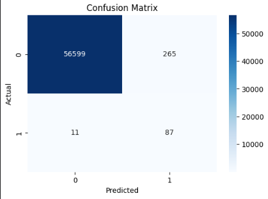

# 💳 Credit Card Fraud Detection System

A machine learning project that detects fraudulent credit card transactions using Logistic Regression and advanced threshold optimization techniques.

---

## 📌 Project Overview

This project builds a fraud detection model using a highly imbalanced dataset.  
The goal is to accurately identify fraudulent transactions while minimizing false alarms.

Due to the imbalance in the dataset, traditional accuracy is not reliable.  
Instead, the model is evaluated using precision, recall, and F1-score.

---

## ⚙️ Features

- Data preprocessing and feature scaling
- Handling imbalanced data
- Logistic Regression model
- Threshold optimization using F1-score
- Performance evaluation (Precision, Recall, F1-score)
- Confusion matrix analysis
- Model saving and loading using joblib

---

## 📊 Final Model Performance

| Metric     | Value |
|-----------|------|
| Precision | 0.25 |
| Recall    | 0.89 |
| F1-score  | ~0.39 |

### Confusion Matrix




### ✅ Interpretation

- The model detects **89% of fraud cases**
- Precision of **25%** reduces false positives significantly compared to baseline
- Provides a strong balance between fraud detection and usability

---

## 🧠 Model Details

- Model: Logistic Regression
- Solver: `lbfgs`
- Scaling: StandardScaler
- Threshold: **0.9 (manually selected for balance)**

> Although F1 optimization produced a threshold close to 1.0, a threshold of 0.9 was chosen for better real-world performance.

---

## 📁 Project Structure
```
ml-project/
│
├── data/
│ └── creditcard.csv
│
├── notebooks/
│ └── fraud_detection.ipynb
│
├── models/
│ ├── fraud_model.pkl
│ └── scaler.pkl
│
├── README.md
└── requirements.txt
```


---

## ⚡ Installation

1. Clone the repository:

```bash
git clone https://github.com/Hakeem638/ml_project.git
cd ml_project
```

2. Create virtual environment:

```bash
python -m venv .venv
.venv\Scripts\activate   # Windows
```

3. Install dependencies:

```bash
pip install -r requirements.txt
```

### Load the pretrained model

import joblib

model = joblib.load('models/fraud_model.pkl')
scaler = joblib.load('models/scaler.pkl')

```

## 🧠Predict a Transaction

```
def predict_transaction(input_data, threshold=0.9):
    import numpy as np
    
    input_data = np.array(input_data).reshape(1, -1)
    input_scaled = scaler.transform(input_data)
    
    prob = model.predict_proba(input_scaled)[0][1]
    prediction = 1 if prob >= threshold else 0
    
    return prediction, prob

```

## 📉 Key Insight

Fraud detection is a highly imbalanced classification problem where:

- Accuracy is misleading  
- Precision and recall are more informative  
- Threshold tuning significantly affects model behavior  

This project demonstrates how adjusting the decision threshold improves the balance between detecting fraud and reducing false positives.

## 👤 Author

Abdul Hakeem

## 📜 License

This project is for educational purposes.
